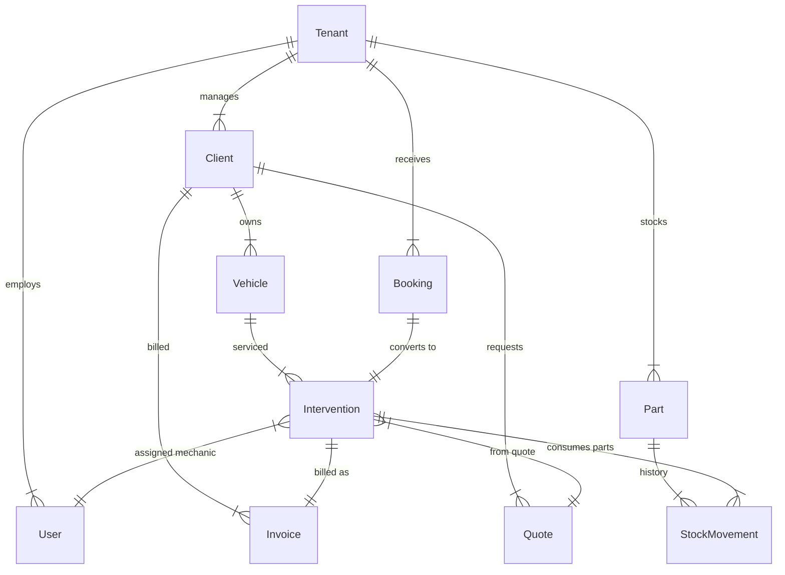

# Apios Garage - Architecture & Schema Reference

## 🛠️ Tech Stack

| Component | Choice | Justification |
| :--- | :--- | :--- |
| **Framework** | **Next.js 15** (App Router) | Unified Frontend/Backend, Server Components, SEO for booking pages. |
| **Language** | **TypeScript** | Type safety across the entire stack. |
| **Database** | **PostgreSQL** | Robust relational data, hosted on Supabase. |
| **ORM** | **Prisma** | Type-safe queries, migrations, and **Multi-tenancy via Extensions**. |
| **Auth** | **NextAuth.js** | Database-agnostic auth, owns the `User` & `Session` tables. |
| **UI** | **Tailwind** + **shadcn/ui** | Modern, accessible, and customizable UI components. |

---

## 🚀 Deployment Strategy

### Recommendation: **Vercel**
I strongly recommend **Vercel** over a VPS for this specific architecture.

**Why?**
1.  **Wildcard Domains (`*.apios.com`)**: Vercel makes this incredibly easy. You just add `*.apios.com` in the dashboard, and it automatically handles SSL certificates for *every* new garage. On a VPS, managing Wildcard SSL certificates (Let's Encrypt DNS challenges) is complex and requires maintenance.
2.  **Zero-Config**: It understands Next.js perfectly. No need to configure Nginx, PM2, Docker, etc.
3.  **CI/CD**: Automatic deployments when you push to GitHub.

### Deployment Process
1.  **Database**: Create a project on **Supabase**. Get the `DATABASE_URL`.
2.  **Codebase**: Push code to **GitHub**.
3.  **Vercel**: Import the GitHub repo.
    *   Add Environment Variables (`DATABASE_URL`, `NEXTAUTH_SECRET`, etc.).
    *   **Domain Config**: Add your main domain `apios.com`. Then add a wildcard domain `*.apios.com`.
4.  **DNS**: Point your domain's Nameservers to Vercel (or configure A/CNAME records).

### Supporting the Booking Logic
*   **Middleware**: The code will have a `middleware.ts` file.
*   **Routing**:
    *   User visits `garage-paris.apios.com`.
    *   Vercel routes request to your app.
    *   Middleware sees the hostname.
    *   Middleware rewrites URL to `/_sites/garage-paris/book` (internal route).
    *   Next.js renders the page for "garage-paris".
*   **SSL**: Vercel automatically issues the certificate for `garage-paris.apios.com`.

---

## 🔐 Multi-Tenancy & Security Logic

### 1. Data Isolation Strategy
*   **Column-based Isolation**: Every single business table (`Client`, `Vehicle`, `Invoice`, etc.) has a `tenantId` column.
*   **Application-Level Enforcement**: We use **Prisma Client Extensions** to automatically inject the `tenantId` into every query.
    *   *Read*: `WHERE tenantId = session.user.tenantId` is added automatically.
    *   *Write*: `data.tenantId = session.user.tenantId` is added automatically.
*   **Benefit**: Developers don't need to manually remember `where: { tenantId }` every time, preventing accidental data leaks.

### 2. Authentication Flow
1.  **Login**: User logs in via NextAuth (Credentials or Magic Link).
2.  **Session**: NextAuth creates a session. We customize the session callback to include `user.tenantId` and `user.role`.
3.  **Request**: On every request (Server Action or API), we retrieve the session.
4.  **Context**: The `tenantId` from the session is passed to the Prisma Client Extension.

---

## 📅 Booking System Logic

### 1. Public Booking Flow (Subdomains)
*   **URL Strategy**: `https://[slug].apios.com/book` (e.g., `garage-paris.apios.com/book`).
*   **Why**: Professional look, prepares for future "Custom Domains" feature.
*   **Implementation (Middleware)**:
    *   Next.js Middleware detects the hostname (e.g., `garage-paris.apios.com`).
    *   It rewrites the request to an internal route: `/_sites/[slug]/book`.
    *   The page receives `params.slug` and fetches the correct Tenant.

### 2. Confirmation Workflow (Dashboard)
1.  **Notification**: Tenant Admin sees a new "Pending Booking".
2.  **Review**: Admin reviews the request details.
3.  **Conversion (One-Click)**:
    *   **Check Client**: System searches for existing `Client` by email/phone. If not found, creates a new `Client`.
    *   **Check Vehicle**: System searches for existing `Vehicle` by license plate. If not found, creates a new `Vehicle`.
    *   **Create Intervention**: Creates an `Intervention` linked to the Client/Vehicle.
    *   **Update Booking**: Sets `Booking` status to `CONFIRMED`.

---

## 🗄️ Database Schema (Prisma)

This schema covers all features listed in [features.md](file:///c:/Users/dry-_/OneDrive/Bureau/Apios/apios_garage_gravity/features.md).

```prisma
generator client {
  provider = "prisma-client-js"
}

datasource db {
  provider = "postgresql"
  url      = env("DATABASE_URL")
}

// --- Enums ---

enum UserRole {
  SUPERADMIN      // Platform Owner
  TENANT_ADMIN    // Garage Owner
  RECEPTION       // Front Desk
  MECHANIC        // Technician
}

enum SubscriptionPlan {
  FREE
  BASIC
  PRO
  ENTERPRISE
}

enum ClientType {
  INDIVIDUAL
  PROFESSIONAL
}

enum InterventionStatus {
  PENDING       // Scheduled / En attente
  IN_PROGRESS   // En cours
  COMPLETED     // Terminé
  CANCELLED     // Annulé
}

enum InvoiceStatus {
  DRAFT
  SENT
  PAID
  OVERDUE
  CANCELLED
}

enum QuoteStatus {
  DRAFT
  SENT
  ACCEPTED
  REJECTED
}

enum StockMovementType {
  IN            // Purchase / Restock
  OUT           // Usage in Intervention
  ADJUSTMENT    // Inventory correction
}

enum BookingStatus {
  PENDING
  CONFIRMED
  REJECTED
  CANCELLED
}

// --- Multi-Tenancy Core ---

model Tenant {
  id          String   @id @default(cuid())
  slug        String   @unique // e.g. "garage-bellevue"
  name        String
  
  // Professional Info
  siret       String?
  vatNumber   String?
  email       String?
  phone       String?
  address     String?
  website     String?
  logoUrl     String?
  
  // Configuration
  openingHours Json?   // Structured JSON for weekly schedule
  
  // Subscription
  plan        SubscriptionPlan @default(FREE)
  subscriptionStatus String?
  
  // Relations
  users           User[]
  clients         Client[]
  vehicles        Vehicle[]
  interventions   Intervention[]
  parts           Part[]
  invoices        Invoice[]
  quotes          Quote[]
  bookings        Booking[]

  createdAt   DateTime @default(now())
  updatedAt   DateTime @updatedAt
}

model User {
  id            String    @id @default(cuid())
  name          String?
  email         String?   @unique
  password      String?
  image         String?
  role          UserRole  @default(MECHANIC)
  
  tenantId      String?
  tenant        Tenant?   @relation(fields: [tenantId], references: [id])

  // NextAuth
  accounts      Account[]
  sessions      Session[]
  
  // Assignments
  interventions Intervention[]

  createdAt     DateTime @default(now())
  updatedAt     DateTime @updatedAt
}

// --- Business Entities ---

model Client {
  id          String     @id @default(cuid())
  tenantId    String
  tenant      Tenant     @relation(fields: [tenantId], references: [id])
  
  type        ClientType @default(INDIVIDUAL)
  
  // Contact
  firstName   String
  lastName    String
  email       String?
  phone       String?
  address     String?
  city        String?
  zipCode     String?
  
  // Professional (if type == PROFESSIONAL)
  companyName String?
  siret       String?
  vatNumber   String?
  
  vehicles    Vehicle[]
  invoices    Invoice[]
  quotes      Quote[]
  
  createdAt   DateTime   @default(now())
  updatedAt   DateTime   @updatedAt
}

model Vehicle {
  id             String   @id @default(cuid())
  tenantId       String
  tenant         Tenant   @relation(fields: [tenantId], references: [id])
  
  clientId       String
  client         Client   @relation(fields: [clientId], references: [id])
  
  licensePlate   String
  vin            String?
  brand          String
  model          String
  year           Int?
  mileage        Int?     // Current mileage
  
  interventions  Intervention[]
  
  createdAt      DateTime @default(now())
  updatedAt      DateTime @updatedAt

  @@unique([tenantId, licensePlate])
}

model Intervention {
  id          String             @id @default(cuid())
  tenantId    String
  tenant      Tenant             @relation(fields: [tenantId], references: [id])
  
  vehicleId   String
  vehicle     Vehicle            @relation(fields: [vehicleId], references: [id])
  
  description String
  status      InterventionStatus @default(PENDING)
  
  // Planning
  startDate   DateTime? // RDV Start
  endDate     DateTime? // RDV End
  
  // Assignment
  mechanicId  String?
  mechanic    User?     @relation(fields: [mechanicId], references: [id])
  
  // Financials
  partsCost   Decimal   @default(0)
  laborCost   Decimal   @default(0)
  totalCost   Decimal   @default(0)
  
  notes       String?   @db.Text
  
  // Links
  invoice     Invoice?
  quoteId     String?
  quote       Quote?    @relation(fields: [quoteId], references: [id])
  bookingId   String?   @unique
  booking     Booking?  @relation(fields: [bookingId], references: [id])
  
  movements   StockMovement[] // Parts used
  
  createdAt   DateTime  @default(now())
  updatedAt   DateTime  @updatedAt
}

model Booking {
  id          String        @id @default(cuid())
  tenantId    String
  tenant      Tenant        @relation(fields: [tenantId], references: [id])

  // Customer Input (Might not exist in DB yet)
  firstName   String
  lastName    String
  email       String
  phone       String
  vehicleInfo String        // e.g. "Clio 4, AB-123-CD"

  // Request
  serviceType String        // e.g. "Vidange"
  requestedDate DateTime
  notes       String?

  status      BookingStatus @default(PENDING)

  // Conversion
  intervention Intervention?

  createdAt   DateTime      @default(now())
  updatedAt   DateTime      @updatedAt
}

model Part {
  id          String   @id @default(cuid())
  tenantId    String
  tenant      Tenant   @relation(fields: [tenantId], references: [id])
  
  name        String
  reference   String   // SKU
  manufacturer String?
  
  buyPrice    Decimal
  sellPrice   Decimal
  
  stock       Int      @default(0)
  minStock    Int      @default(5)
  
  movements   StockMovement[]
  
  createdAt   DateTime @default(now())
  updatedAt   DateTime @updatedAt

  @@unique([tenantId, reference])
}

model StockMovement {
  id             String            @id @default(cuid())
  tenantId       String
  
  partId         String
  part           Part              @relation(fields: [partId], references: [id])
  
  type           StockMovementType
  quantity       Int               // Positive for IN, Negative for OUT
  
  interventionId String?
  intervention   Intervention?     @relation(fields: [interventionId], references: [id])
  
  createdAt      DateTime          @default(now())
}

model Quote { // Devis
  id             String      @id @default(cuid())
  tenantId       String
  tenant         Tenant      @relation(fields: [tenantId], references: [id])
  
  clientId       String
  client         Client      @relation(fields: [clientId], references: [id])
  
  number         String
  status         QuoteStatus @default(DRAFT)
  
  totalAmount    Decimal
  validUntil     DateTime?
  
  interventions  Intervention[] // Can generate interventions if accepted
  
  createdAt      DateTime    @default(now())
  updatedAt      DateTime    @updatedAt

  @@unique([tenantId, number])
}

model Invoice {
  id             String        @id @default(cuid())
  tenantId       String
  tenant         Tenant        @relation(fields: [tenantId], references: [id])
  
  clientId       String
  client         Client        @relation(fields: [clientId], references: [id])
  
  interventionId String?       @unique
  intervention   Intervention? @relation(fields: [interventionId], references: [id])
  
  number         String
  status         InvoiceStatus @default(DRAFT)
  
  totalAmount    Decimal
  taxAmount      Decimal
  
  issuedAt       DateTime      @default(now())
  dueDate        DateTime?
  
  createdAt      DateTime      @default(now())
  updatedAt      DateTime      @updatedAt

  @@unique([tenantId, number])
}

// --- NextAuth Models (Standard) ---
model Account {
  id                 String  @id @default(cuid())
  userId             String
  type               String
  provider           String
  providerAccountId  String
  refresh_token      String? @db.Text
  access_token       String? @db.Text
  expires_at         Int?
  token_type         String?
  scope              String?
  id_token           String? @db.Text
  session_state      String?

  user User @relation(fields: [userId], references: [id], onDelete: Cascade)

  @@unique([provider, providerAccountId])
}

model Session {
  id           String   @id @default(cuid())
  sessionToken String   @unique
  userId       String
  expires      DateTime
  user         User     @relation(fields: [userId], references: [id], onDelete: Cascade)
}

model VerificationToken {
  identifier String
  token      String   @unique
  expires    DateTime

  @@unique([identifier, token])
}
```

## 📊 Entity Relationships Diagram


